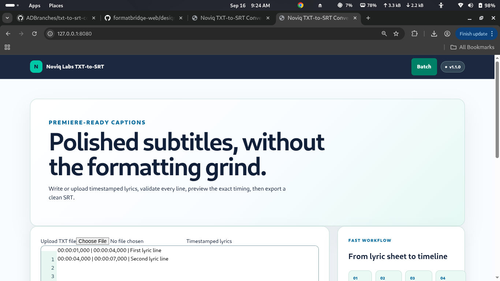
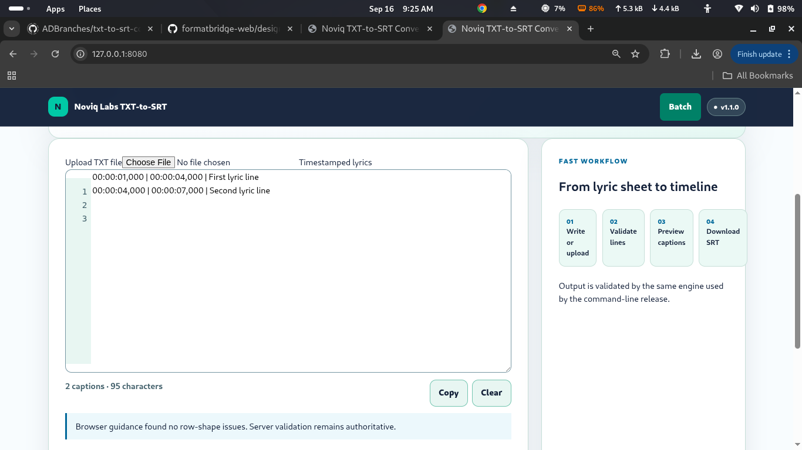
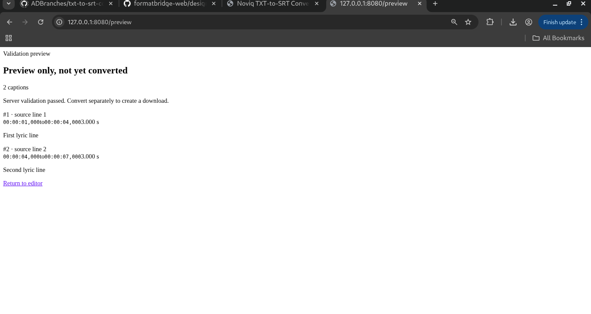
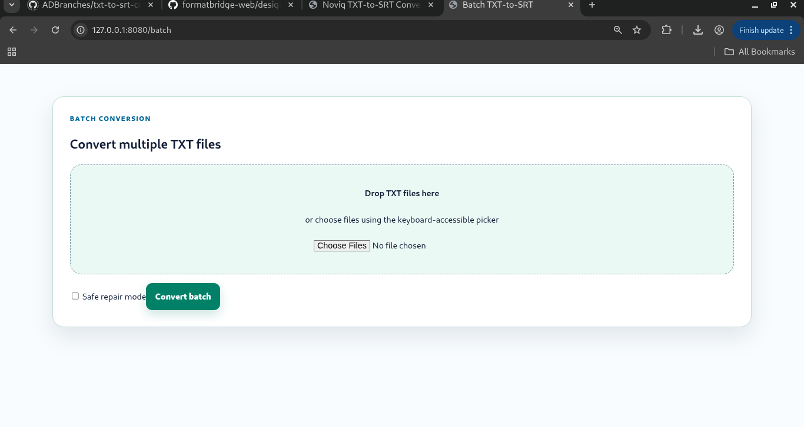

# UI User Guide

## Editor

Paste or upload timestamped lyrics, validate, preview, convert, and download.

## Validation

## Preview

## Batch

Use `/batch` for multiple TXT files, truthful per-file results, individual SRT downloads, and a success-only ZIP.
